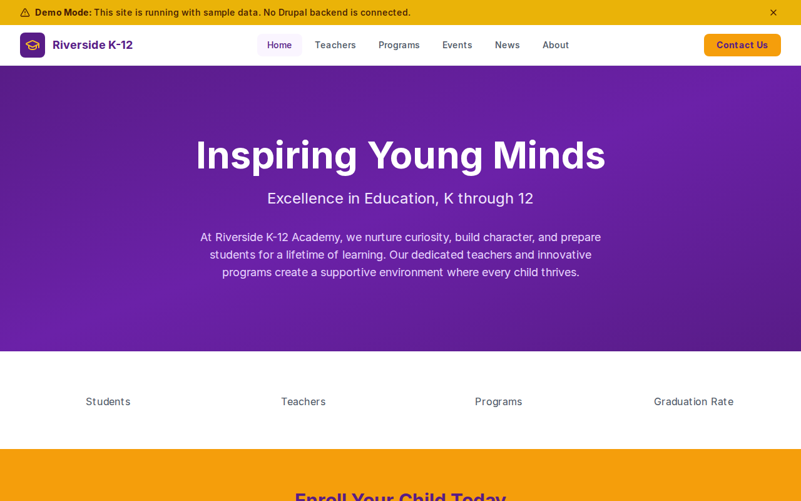

# Decoupled K-12

A comprehensive website starter for K-12 schools, academies, and private schools. Built with Next.js 15 and Drupal CMS, this starter helps schools communicate with families, showcase academic programs, share news and events, and highlight their teaching staff.



[](https://vercel.com/new/clone?repository-url=https://github.com/nextagencyio/decoupled-k12&project-name=k12-school-site)

## Features

- **Teachers** -- Profile teaching staff with department, subjects taught, contact info, office/room location, and professional photos
- **Programs** -- Showcase academic and extracurricular programs with grade levels, departments, schedules, and descriptions
- **Events** -- Promote school events, assemblies, and activities with dates, times, locations, and event type categories
- **News** -- Publish school announcements, achievements, and updates with featured flags and category filtering
- **Homepage** -- Engaging hero section, school statistics (students, teachers, programs, graduation rate), featured programs, and enrollment CTA
- **Basic Pages** -- Static content for About, Admissions, and other informational pages

## Quick Start

### 1. Clone the template

```bash
npx degit nextagencyio/decoupled-k12 my-school-site
cd my-school-site
npm install
```

### 2. Run interactive setup

```bash
npm run setup
```

This interactive script will:
- Authenticate with Decoupled.io (opens browser)
- Create a new Drupal space
- Wait for provisioning (~90 seconds)
- Configure your `.env.local` file
- Import sample content

### 3. Start development

```bash
npm run dev
```

Visit [http://localhost:3000](http://localhost:3000)

---

## Manual Setup

If you prefer to run each step manually:

<details>
<summary>Click to expand manual setup steps</summary>

### Authenticate with Decoupled.io

```bash
npx decoupled-cli@latest auth login
```

### Create a Drupal space

```bash
npx decoupled-cli@latest spaces create "Riverside K-12 Academy"
```

Note the space ID returned (e.g., `Space ID: 1234`). Wait ~90 seconds for provisioning.

### Configure environment

```bash
npx decoupled-cli@latest spaces env 1234 --write .env.local
```

### Import content

```bash
npm run setup-content
```

This imports the following sample content:

**Teachers:**
- Maria Martinez (Mathematics -- Algebra, Geometry, AP Calculus)
- David Chen (Science -- Biology, Chemistry, Robotics)
- Sarah Williams (English -- English Literature, Creative Writing, Drama)
- James Jackson (Athletics -- Physical Education, Health, Coaching)

**Programs:**
- STEM Academy (Middle/High School -- project-based learning, coding, robotics)
- Performing Arts Program (All grades -- band, choir, drama, dance)
- Athletics Program (Middle/High School -- basketball, soccer, track, swimming)
- Early Learning Center (Elementary -- play-based, Montessori-inspired K-2)

**Events:**
- Back to School Night (September 2026)
- Spring Science Fair (April 2026)
- Spring Concert & Art Show (May 2026)

**News:**
- Riverside Academy Wins Regional STEM Award
- New Playground Opens for Elementary Students
- Students Read Over 10,000 Books in Annual Reading Challenge

**Pages:**
- About Riverside K-12 Academy
- Admissions & Enrollment

</details>

## Content Types

### Teacher
| Field | Type | Description |
|-------|------|-------------|
| title | string | Teacher name |
| body | rich text | Professional biography |
| department | taxonomy | Department (mathematics, science, english, arts, athletics) |
| email | string | School email address |
| phone | string | School phone number |
| office | string | Office or room location |
| photo | image | Professional headshot |
| subjects | string[] | Subjects taught |

### Program
| Field | Type | Description |
|-------|------|-------------|
| title | string | Program name |
| body | rich text | Full program description |
| grade_level | taxonomy | Grade levels (elementary, middle-school, high-school) |
| department | taxonomy | Associated department |
| schedule | string | Meeting schedule |
| image | image | Program showcase image |

### School Event
| Field | Type | Description |
|-------|------|-------------|
| title | string | Event name |
| body | rich text | Event description and schedule |
| event_date | datetime | Start date and time |
| end_date | datetime | End date and time |
| location | string | Venue or location |
| event_type | taxonomy | Category (orientation, academic, performance) |
| image | image | Event promotional image |

### News Article
| Field | Type | Description |
|-------|------|-------------|
| title | string | Headline |
| body | rich text | Full article text |
| image | image | Featured image |
| category | taxonomy | Category (achievements, campus-updates) |
| featured | boolean | Feature flag for homepage |

### Homepage
| Field | Type | Description |
|-------|------|-------------|
| hero_title | string | Main headline |
| hero_subtitle | string | Supporting tagline |
| hero_description | rich text | Hero body copy |
| stats_items | paragraph[] | School statistics (number + label) |
| featured_programs_title | string | Programs section heading |
| cta_title | string | Enrollment CTA heading |
| cta_description | rich text | CTA body copy |
| cta_primary / cta_secondary | string | CTA button labels |

## Customization

### Colors & Branding
Edit `tailwind.config.js` to customize the purple and amber color scheme. Update the Header component logo icon and school name.

### Content Structure
Modify `data/k12-content.json` to add or change content types, taxonomies (departments, grade levels, event types), and sample content.

### Components
React components are in `app/components/`. Key files:
- `HomepageRenderer.tsx` -- Landing page layout with hero, stats, and CTA
- `TeacherCard.tsx` / `ProgramCard.tsx` -- Staff and program listing cards
- `EventCard.tsx` / `NewsCard.tsx` -- Event and news cards
- `Header.tsx` -- Navigation and school branding

## Demo Mode

Demo mode allows you to showcase the application without connecting to a Drupal backend.

### Enable Demo Mode

```bash
NEXT_PUBLIC_DEMO_MODE=true
```

### Removing Demo Mode

1. Delete `lib/demo-mode.ts`
2. Delete `data/mock/` directory
3. Delete `app/components/DemoModeBanner.tsx`
4. Remove `DemoModeBanner` from `app/layout.tsx`
5. Remove demo mode checks from `app/api/graphql/route.ts`

## Deployment

### Vercel (Recommended)
[](https://vercel.com/new/clone?repository-url=https://github.com/nextagencyio/decoupled-k12)

Set `NEXT_PUBLIC_DEMO_MODE=true` in Vercel environment variables for a demo deployment.

### Other Platforms
Works with any Node.js hosting platform that supports Next.js.

## Documentation

- [Decoupled.io Docs](https://www.decoupled.io/docs)
- [Next.js Documentation](https://nextjs.org/docs)
- [Drupal GraphQL](https://www.decoupled.io/docs/graphql)

## License

MIT
